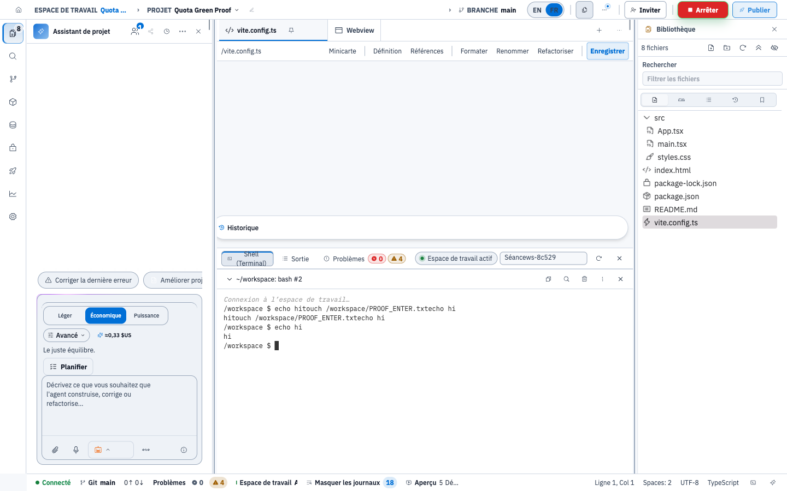
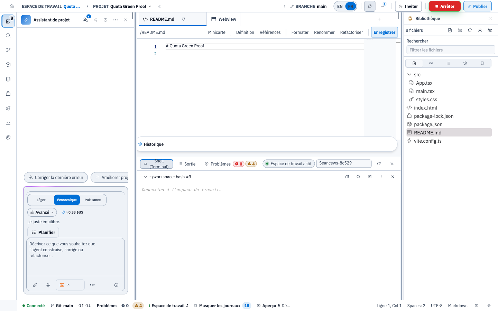

# BUG-QUOTA-001 — correctif, preuves, et récapitulatif pour la revue expert

**SHA du correctif : `8a5ea8564d` (`8a5ea8564d5b3597d2b2d7808275cd4b0e743330`), branche
`fix/quota-per-session-terminal`.**
Image d'audit : `europe-west9-docker.pkg.dev/vibecore-audit-test-20260807/vibecore-audit-containers/api@sha256:ab42cc368703d34cbfc985d8e5bc3841970ad176db47cd49ef33ff086409f4c3`.

> ⛔ **NON MERGÉ EN PROD, ET À NE PAS MERGER SANS REVUE EXPERT.** Lot facturation :
> toucher au décompte de concurrence a des effets de facturation. La production n'a
> jamais été touchée (contrôle ci-dessous, §5).

---

## 1. Le défaut

`services/api/src/app.ts`, route `GET /api/runtime/workspaces/:workspaceId/terminal`.

La jauge `terminals.concurrent` était indexée sur la **connexion** : chaque socket
appelait `ensureQuota` puis `recordUsage(+1)`, et posait `recordUsage(-1)` à la
fermeture. Depuis que le rattachement fonctionne (BUG-TERM-002 : `sessionId` stable),
un rechargement de page rouvre un socket **sur le shell qui existe déjà côté agent** —
et redemandait donc un second créneau. Sur l'offre gratuite (`terminals.concurrent: 1`),
l'unique terminal de l'organisation **rejetait sa propre reconnexion en 429**, et le
panneau ne revenait jamais. C'est ce qui rendait `echo hi` + Entrée inexécutable.

Le shell **managé** (`?managed=1`) échappait au quota, d'où le fait qu'il était le seul
panneau utilisable — mais il exécute `npm run dev`, donc il n'est pas un terminal
utilisateur.

## 2. Le correctif

La clé porte sur la **session**. Avant le `+1`, et **dans le `withSerializedMutation('terminals:<org>')`
déjà présent**, on lit la somme nette de `quantity` pour
`(organizationId, type, metadata.workspaceId, metadata.sessionId)` :

- somme **> 0** → **rattachement** : ni `ensureQuota`, ni `+1`, ni `-1` à la fermeture ;
- somme **≤ 0** → nouvelle session : comportement d'avant, strictement inchangé.

### Exigences fail-closed — comment chacune est tenue

| Exigence | Mécanisme |
|---|---|
| **Jauge jamais négative** | Drapeau `countedThisSocket`, posé *uniquement* après un `+1` réussi, qui conditionne le `-1` du `onClose`. Un socket qui a rattaché ne décrémente jamais un créneau qu'il n'a pas payé. |
| **Pas de créneau gratuit par rejeu de `sessionId`** | La décision se prend sur l'**état persisté** (somme nette en base), jamais sur l'identifiant annoncé par le client. Un id inconnu ou forgé n'a aucune entrée nette positive → retombe sur `ensureQuota` + `+1` → refusé si l'org est à sa limite. |
| **Concurrence** | La lecture est **dans la même section sérialisée** que le `+1`. Deux sockets simultanés sur un même `sessionId` ne peuvent pas conclure tous les deux « déjà compté ». |
| **`sessionId` absent** | Retombe sur « **compter** », jamais sur « ne pas compter ». Un id non-`string` est traité comme absent. |

### Deux durcissements au-delà de la note de conception

1. **Le rapprochement exige AUSSI le `workspaceId`.** Les identifiants de session sont
   forgés par panneau (`terminal-user-0`) et **se répètent d'un workspace à l'autre** :
   sans cette condition, deux terminaux réellement distincts, dans deux workspaces d'une
   même organisation, n'auraient tenu qu'un seul créneau. C'est un trou fail-open que la
   conception d'origine laissait ouvert.
2. **La lecture est bornée à la MÊME fenêtre glissante que la jauge**
   (`TERMINAL_CONCURRENCY_WINDOW_MS`, cf. `computeUsageForQuota`). Un `+1` dont la
   fermeture a été perdue sort des deux au même instant : il ne peut pas figer une
   session en « déjà comptée » pour toujours alors que la jauge l'a déjà oubliée.

### Diff

5 fichiers, +493/−1 :

| Fichier | Rôle |
|---|---|
| `services/api/src/app.ts` | la route : détection de rattachement, `countedThisSocket`, métadonnées `sessionId` |
| `services/api/src/store.ts` | contrat `sumUsageForSession(...)` |
| `services/api/src/prisma-store.ts` | implémentation Postgres (deux prédicats JSON path, bornés par l'index `(organizationId, type)`) |
| `services/api/src/tests/test-api-store.ts` | implémentation en mémoire |
| `services/api/src/tests/terminal-quota-session.spec.ts` | les 6 tests (nouveau) |

## 3. Tests

`services/api/src/tests/terminal-quota-session.spec.ts` — 6 cas sur de **vrais WebSockets**
traversant l'API, jauge relue **dans le magasin** (jamais un mock de la couche quota) :

| # | Cas | Attendu |
|---|---|---|
| 1 | rattachement à une session déjà comptée | admis, **0 créneau** consommé (donc `ensureQuota` non appliqué : sur `used=1/limit=1` il aurait rejeté) |
| 2 | fermeture d'un socket rattaché | **pas de `-1`**, jauge inchangée, jamais négative |
| 3 | rejeu d'un `sessionId` sans entrée nette positive | **compté normalement** et **refusé à la limite** (+ collision inter-workspaces également comptée) |
| 4 | deux sockets **concurrents** sur un même `sessionId` | un seul créneau, jauge finale 0 |
| 5 | deux terminaux **réellement distincts** | **2 créneaux** ; et sur l'offre gratuite le 2ᵉ est refusé |
| 6 | `sessionId` absent | comportement d'avant préservé |

**Repro rouge→vert sur ce code** : contre la route d'avant, **3 des 6 échouent** — les 3
qui décrivent le défaut (1, 2, 4) ; les 3 autres (3, 5, 6) passent avant comme après,
ce sont les garanties de non-régression.

**Suite complète `services/api`** : `187 fichiers passés | 4 ignorés`, `1616 tests passés
| 0 échec | 35 ignorés`. `tsc -p services/api/tsconfig.json --noEmit` : propre.

## 4. Preuves en réel sur l'environnement d'audit

Compte **créé pour l'occasion** (`quota-green-…@local.test`, offre **gratuite**,
`terminals.concurrent = 1`), projet `Quota Green Proof`, workspace `ws-8c52985fc155fdf2`.

### 4.1 Preuve à l'écran — `echo hi` + Entrée



Dans le terminal **utilisateur** (`~/workspace: bash #2`, pas le shell managé) :

```
/workspace $ echo hi
hi
/workspace $ ▮
```

C'est très exactement ce que BUG-QUOTA-001 empêchait. Le 2ᵉ PTY `bash` est réellement
présent dans le pod (`ps aux` → deux `/bin/bash --noprofile --rcfile …jsh-osc.bashrc -i`).



### 4.2 Décompte serveur, corrélé requête par requête

Journaux des réplicas API sur la fenêtre de preuve, chaque `reqId` de socket `/terminal`
apparié à son éventuel `QUOTA_EXCEEDED` :

| `sessionId` | connexions | 429 |
|---|---:|---:|
| `terminal-managed` | 6 | **0** — exempté, inchangé |
| **`terminal-user-0`** | **5** | **0** ← *le cas du bug : 5 connexions, dont 4 rattachements, toutes admises* |
| `terminal-user-3` | 18 | 18 ← *2ᵉ terminal réellement distinct sur une limite 1 → **refus correct*** |

Avant correctif, sur ce même environnement et un compte neuf identique
(image `api:59818de207`) : **41 connexions `terminal-user-0` → 32 × `429
QUOTA_EXCEEDED terminals.concurrent used=1 limit=1`**, pendant que `terminal-managed`
passait 11 fois sur 11.

### 4.3 Intégrité du grand livre (lue en base)

Pour les **5** connexions sur `terminal-user-0`, la table `UsageEvent` contient
**exactement une paire** :

```
 +1  {"sessionId":"terminal-user-0","workspaceId":"ws-8c52985fc155fdf2"}  09:02:37.901Z
 -1  {"sessionId":"terminal-user-0","workspaceId":"ws-8c52985fc155fdf2"}  09:19:28.810Z
```

- jauge finale **0**, **minimum atteint 0** — **jamais négative** ;
- les 4 rattachements n'ont produit **aucun** événement (ni `+1`, ni `-1`) ;
- `terminal-user-3` (18 tentatives) n'a produit **aucun** événement : refusé par
  `ensureQuota` **avant** tout `+1` — pas de créneau gratuit par session inconnue ;
- les métadonnées portent bien `sessionId` **et** `workspaceId`.

### 4.4 Contrôle rouge/vert reproductible, indépendant du navigateur

`docs/audit/evidence/BUG-QUOTA-001/paired-probe.mjs` ouvre A puis B sur le **même**
`sessionId` (A resté ouvert = le cas rattachement), puis C sur un `sessionId` réellement
différent. Exécuté deux fois sur l'image corrigée, dont une **après un aller-retour de
déploiement** :

```
  A  ADMIS   terminal-ctl-vert    socket ouvert, pas de 429
  B  ADMIS   terminal-ctl-vert    socket ouvert, pas de 429   <-- LE CAS DU BUG
  C  REFUSE  terminal-ctl-vert-autre                          <-- contrôle positif (limite 1)
```

## 5. Périmètre de déploiement — la production n'a pas été touchée

- Déploiement par `kubectl set image` **par digest**, sur le seul contexte
  `gke_vibecore-audit-test-20260807_…`, derrière une garde statique qui refuse tout
  contexte contenant `vibecore-prod` ou `connectgateway_vibecore-495216`, plus une
  vérification que le Deployment ciblé pointe déjà sur le registry d'audit.
- Contrôle relevé pendant l'opération — image de la **prod** :
  `europe-west9-docker.pkg.dev/vibecore-495216/vibecore-prod-containers/api:4b40964314`
  (registry, projet et tag distincts ; jamais modifiée).
- Image de rollback de l'env d'audit : `api:59818de207`.

## 6. Réserves à porter à la revue

1. **Sous-comptage borné pendant un chevauchement.** Si deux sockets vivent en même temps
   sur une session et que **le propriétaire du `+1` se ferme le premier**, son `-1` part
   alors que le socket rattaché est encore vivant : la session reste ouverte sans créneau
   jusqu'à sa prochaine ouverture. C'est le compromis explicitement retenu par la note de
   conception (l'alternative — ne décrémenter que si plus aucun socket de la session n'est
   vivant — exige un état partagé entre réplicas). Effet : sous-comptage transitoire, borné
   à la durée du chevauchement. **Jamais de jauge négative.**
2. **`+1` orphelin si le socket meurt pendant la section sérialisée** : le `onClose` est
   posé après l'`await`. Défaut **préexistant**, non introduit ici, et il penche du côté
   sûr (sur-comptage) ; la fenêtre glissante l'efface. Non traité pour garder le diff au
   périmètre du bug.
3. **Numérotation des panneaux côté client — diagnostiquée, et corrigée ailleurs.**
   Après un rechargement, le panneau demandait `terminal-user-3`, puis `terminal-user-6`
   au relevé suivant, jamais `terminal-user-0` : `sessionKey = user-${#terminals.length}`
   (`app/lib/stores/terminal.ts`) n'est pas l'identité du panneau — le tableau ne fait que
   **croître** (un spawn en échec n'ajoute rien, une fermeture ne retire rien), donc
   l'index dérive à chaque montage. Comme l'agent clé son shell sur `?sessionId`, le
   panneau ne rattachait **jamais** son propre shell ; et sur une offre dont le créneau est
   déjà pris, il se faisait refuser (**27 × 429** relevés) et restait bloqué sur
   « Connexion à l'espace de travail… ». **C'est un défaut CLIENT, sans rapport avec le
   quota** : la couche quota, elle, faisait exactement son travail — refuser un second
   terminal réellement distinct sur une limite 1.
   Corrigé séparément sur **`fix/terminal-pane-session-key`** (SHA `601a649f54`), branché
   sur le dernier commit terminal **non sensible** (`00cd6ec8`) et **sans aucun commit de
   quota**, pour rester mergeable indépendamment de ce lot facturation.
4. **Formats tablette/mobile non vérifiés** pour cette preuve : la validation à l'écran a
   été faite en **desktop 1440** uniquement.

## 7. Ce qui est mergeable sans revue facturation

Sur `fix/quota-per-session-terminal`, **un seul** commit touche le décompte de quota :

- ⛔ **`8a5ea856`** — `fix(quota)` : le lot sensible, celui qui attend la revue expert
  (et `38ec4062`, ses preuves).

Tout ce qui est **en dessous** est du lot terminal/QA ordinaire, sans code de facturation —
notamment `b40b7f66` (les frappes n'atteignaient pas le PTY), `ff727b18` (propagation
`sessionId`/`cols`/`rows`), `98c1bb1e` (identifiant de session par panneau), `00cd6ec8`
(porte d'entrée ouverte sur `prompt`). La branche `fix/terminal-pane-session-key` prolonge
exactement cette pile, sans le commit de quota.
