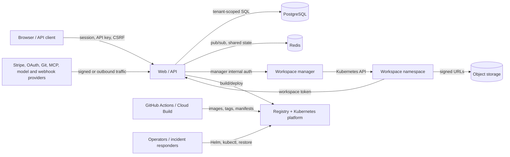

# E-Code Gate 1 Security Threat Model

## Audit identity and verdict

| Field | Value |
|---|---|
| Repository | `openaxcloud/vibecore` |
| Audited code commit | `8a93e995b37de513a142acaf41fed364787c5e4e` |
| Audit gate | Gate 1, read-only source audit |
| Scope | Authentication, authorization, tenant/runtime isolation, secrets, outbound requests, agents/connectors, storage, billing webhooks, deletion, supply chain, logging and incident evidence |
| Verdict | **NOT_READY** |
| Signed status | **No capability in this document is `SIGNED_PROVEN`** |

This threat model is tied only to the commit above. Historical live evidence and tracker states are useful context, but do not prove an unchanged invariant at this SHA. No production system, production secret, destructive operation or paid cloud resource was used.

The detailed machine-readable gaps and risks are in [`GAP_REGISTER.yaml`](./GAP_REGISTER.yaml) and [`RISK_REGISTER.yaml`](./RISK_REGISTER.yaml). Deployment ground truth and operational commands remain in [`docs/DEPLOY_RUNBOOK.md`](../DEPLOY_RUNBOOK.md); this document does not replace that runbook.

## Security objectives

1. A user, API key, workspace, agent, connector or deployment can act only on explicitly authorized tenant resources.
2. A user workspace cannot reach the node host, cloud metadata, platform control plane, another tenant's network, volume, secret, database or storage.
3. Secrets never return to an unauthorized browser, export, log, trace, model context, tool result or deployment artifact.
4. Destructive and financial operations fail closed, are idempotent, have a durable linearization point and recover after process failure.
5. Server-side fetches cannot reach loopback, private, link-local, metadata or unauthorized cluster addresses, including after DNS resolution and redirects.
6. The reviewed commit maps to the exact signed artifact bytes deployed and restored.
7. Audit evidence identifies actor, action, tenant, target, time, request/correlation ID, source and outcome without containing a secret.

## Assets and data classifications

| Asset | Classification | Primary owners | Required protection |
|---|---|---|---|
| Session tokens, API keys, OAuth/MCP/provider tokens, project/deployment secrets | Restricted credential | Identity, secrets, connector domains | Encryption, redaction, rotation, revocation, least privilege, never export raw/verifier values |
| Customer source, Git history, snapshots, PVC and object data | Confidential tenant data | Projects, runtime, storage domains | Tenant isolation, integrity manifest, backup/restore, deletion receipt |
| AI conversations, context index, agent memory and tool results | Confidential tenant data, potentially sensitive | Agent/context domains | Tenant scope, prompt-injection controls, retention and deletion, secret filtering |
| Organization roles, memberships, SSO/SCIM and audit records | Confidential security data | Identity/organizations/audit | Server authorization, protected audit history, re-auth/MFA for dangerous actions |
| Credit balance, ledger, Stripe events, usage and invoices | Restricted financial data | Billing/ledger | Atomicity, idempotency, reconciliation, immutable audit trail |
| Deployment images, manifests, SBOM, provenance and signatures | Integrity-critical artifact | Build/deployment/supply-chain | Digest identity, signing, admission verification, retained rollback evidence |
| Logs, metrics, traces and support exports | Confidential operational data | Observability/security | Redaction, tenant/actor fields, retention, controlled export |
| Cloud credentials, service accounts, cluster and database administration | Platform root of trust | Infrastructure/security | Workload identity, least privilege, no workspace exposure, break-glass audit |

## Actors and attacker models

- Unauthenticated internet client probing public auth, sharing, preview, webhook and deployment surfaces.
- Authenticated member substituting organization/project/workspace/object identifiers or using stale authority after removal.
- Malicious organization owner attempting cross-tenant, host or cloud-metadata access through code, preview, terminal, Git import, connectors, MCP or provider URLs.
- Compromised workspace process with arbitrary code execution inside its pod.
- Malicious repository, ZIP, symlink, dependency, template, prompt, tool output or MCP server attempting traversal, code execution or instruction injection.
- Compromised API/workspace-manager/worker replica or leaked internal service token.
- Duplicate, delayed, reordered or adversarially timed Stripe/webhook delivery.
- Supply-chain attacker changing a mutable CI action, tag, build dependency or image between review and execution.
- Operator error during Helm upgrade, rollback, migration, restore, data deletion or incident response.
- External provider, Redis, PostgreSQL, GCS, DNS, ingress, node or zone failure creating fail-open behavior.

## Trust boundaries and critical flows



Trust-boundary decisions that must be enforced server-side:

- Browser to API: authenticate, enforce CSRF for cookie mutations, validate tenant membership and permission on every resource.
- External provider to API: validate signature against raw bounded body, deduplicate durably, treat delivery as concurrent and reordered.
- API to outbound provider: validate resolved addresses and redirects, apply egress policy, timeout and response-size limits.
- API to manager: constant-time internal authentication plus exact organization/project/workspace binding.
- Manager to Kubernetes: minimize namespace and secret permissions; generated pod policy is not an admission guarantee.
- Workspace to API/storage: capability must be short-lived, audience/scope-bound and revocable with workspace/project generation.
- Build to runtime: reviewed commit must map to immutable digest, SBOM, provenance and verified signature.
- Operator to production: follow `docs/DEPLOY_RUNBOOK.md`; every privileged action must be attributable and reversible.

## Controls observed in the repository

These controls are real source evidence, but remain below `SIGNED_PROVEN` until exact-SHA tests and required live negatives pass.

### Authentication, authorization and session controls

- `services/api/src/app.ts:3048-3184` validates API-key expiry, user status, membership, scopes and platform-admin MFA requirements.
- `services/api/src/app.ts:3380-3598` centralizes organization and project permission checks, collaborator roles, suspended users and deleted-project policy.
- `services/api/src/app.ts:9732-9867` applies global pre-handler authentication, cookie CSRF, organization IP restrictions and route-specific non-user grants.
- Collaboration tickets are HMAC-authenticated, short-lived and bound to project/session (`services/api/src/app.ts:1829-1910`).
- Internal and preview shared secrets fail closed and use constant-time comparison (`services/api/src/app.ts:3272-3321`).
- Security headers, CORS and bounded raw webhook body handling exist (`services/api/src/app.ts:8201-8350`).

### Runtime controls represented in code

- Workspace/server pod generation requests gVisor, non-root execution, seccomp, dropped capabilities, no service-account token, resource limits and probes (`packages/k8s-client/src/index.ts:645-735,935-1053`).
- Workspace network policy files declare default deny, scoped DNS, project database access and public HTTPS with private/metadata exclusions (`infra/kubernetes/workspaces-runtime/networkpolicies.yaml:1-96`; Helm equivalent under `infra/helm/workspaces-runtime/templates/networkpolicy.yaml`).
- Restricted Pod Security namespace manifests exist (`infra/kubernetes/podsecurity/namespaces.yaml:1-19`).

### Secret and logging controls

- Stored secret payloads use AES-GCM and production requires `CONFIG_ENCRYPTION_KEY` (`packages/security/src/index.ts:100-140`).
- Logger redaction paths and secret-pattern helpers exist (`services/api/src/app.ts:8169-8189`; `packages/security/src/index.ts:1-59`).
- Request/correlation IDs are propagated at API ingress (`services/api/src/app.ts:8276-8309`).

### Positive reliability controls relevant to security

- `/ready` checks PostgreSQL and Redis and fails with 503 (`services/api/src/app.ts:8660-8727`).
- Runtime terminal and file/port watch sockets use bounded exponential backoff with stability-gated reset (`packages/runtime-remote/src/index.ts:520-698,1221-1378`).
- Helm deployment uses `--atomic`, rollout checks and a post-deploy rollback-flag assertion (`.github/workflows/deploy-main.yml:269-401`).

## Priority threats and current verdicts

| Threat | STRIDE | Severity | Current verdict | Evidence |
|---|---|---:|---|---|
| Ledger state changes and financial entries are not atomic across crashes/concurrency | Tampering, repudiation | P0 | **BROKEN** | `services/api/src/ledger-store.ts:195-412` |
| Stripe partial failure can grant one payment twice | Tampering, elevation of entitlement | P0 | **BROKEN** | `services/api/src/app.ts:25561-26007`; `schema.prisma:1983-1994` |
| Rollback marks restored content READY before final-byte digest and may substitute source digest | Tampering, repudiation | P0 | **BROKEN** | `services/api/src/app.ts:6644-6726,33265-33352` |
| Required secret decrypt failure is silently omitted | Tampering, information integrity | P1 | **BROKEN** | `services/api/src/app.ts:2689-2715,13145-13182` |
| Seven-day project storage token remains destructive after authority changes | Spoofing, tampering, elevation | P1 | **BROKEN** | `services/api/src/app.ts:3186-3254,30538-30708` |
| DNS rebinding remains outside hostname blocklist protection | Information disclosure, SSRF/elevation | P1 | **PARTIAL** | `services/api/src/app.ts:2115-2264` |
| Legacy export returns `tokenHash` and broad organization datasets | Information disclosure | P1 | **BROKEN** | `services/api/src/app.ts:17433-17470`; `prisma-store.ts:5981-5993` |
| Tenant isolation lacks exhaustive route and live sandbox negatives | All | P1 | **BLOCKED** | Central guards plus Kubernetes manifests; no exact-SHA live proof |
| Kyverno source has both Audit and Enforce variants; installed state unknown | Elevation, tampering | P1 | **UNKNOWN** | `infra/admission/kyverno/...`; `infra/kubernetes/admission-policies/...` |
| Account/project purge can remove DB identity before external data and workloads | Tampering, repudiation, disclosure | P1 | **BROKEN** | `services/api/src/app.ts:9955-10078,17473-17516,22586-22626` |
| Redis outage silently splits collaboration by API replica | Tampering, denial, repudiation | P1 | **PARTIAL** | `services/api/src/app.ts:7296-7420` |
| Mutable actions/tags and non-gating signature workflow weaken artifact identity | Tampering, supply chain | P1 | **PARTIAL** | `.github/workflows/deploy-main.yml:76-346` |

## Fail-open and fail-closed analysis

| Path | Current behavior | Required policy |
|---|---|---|
| Missing production encryption key | Production startup rejects configuration | Keep fail-closed; prove rotation and recovery |
| Project ciphertext fails decrypt | Secret is omitted and startup continues | Fail closed for required secrets; explicit optional policy only |
| Manager workspace start request fails | Error is swallowed after fire-and-forget request | Persist failure/retry state and never report usable workspace before readiness |
| Stripe event side effect fails after pack grant | Dedup event may be deleted | Keep durable effect state; audit retry must not reopen entitlement |
| Deployment metering fails | Failure swallowed, watermark still advances | Do not advance watermark; reconcile before closing the window |
| Release manifest append fails | Warning only after READY | Keep release non-serving/pending until verified manifest is durable |
| Redis collaboration publish/subscribe fails | Local-only delivery continues | Surface degraded/unavailable state unless recovery contract guarantees resync |
| Rate/routing card DB read or validation fails | Fall back and cache per process | Define explicit billing-safe degraded policy; never silently mix versions |
| Object token signer missing | Workspace object-storage injection is omitted | Acceptable feature-disabled behavior only if surfaced; destructive route must remain inaccessible |
| Internal/preview shared secret missing | Request rejected | Keep fail-closed |

## Tenant-isolation assessment

### API boundary

Central guards are a strong architectural base, but route coverage is not generated or complete enough to sign. Gate 2 should derive an inventory from Fastify registration and require every non-public route to declare one of: user authentication, organization permission, project permission, platform admin with MFA/re-auth, internal service credential, narrowly scoped signed grant or verified external webhook.

Required negative matrix:

- no session, expired/revoked session, suspended user, API key with wrong scope;
- organization member versus owner/custom role and last-owner transitions;
- project collaborator read/write versus organization role;
- identifier substitution across project, workspace, deployment, database, object, snapshot, secret, conversation, agent run and audit endpoints;
- WebSocket/SSE ticket replay, wrong project/session, expired ticket and membership revoked after ticket issuance;
- existence/timing leakage for another tenant's identifier.

### Runtime and network boundary

Generated manifests are not live enforcement proof. The repository contains two Kyverno policy sources with different enforcement modes. `deploy-main.yml` does not establish installation. A real test cluster must prove:

- non-gVisor, privileged, host namespace, hostPath, service-account token, missing limit/probe and mutable `latest` pods are rejected;
- a valid generated workspace pod is admitted;
- pod cannot read node filesystem, cloud metadata, Kubernetes API, control-plane services, another workspace service/PVC/secret or another project's database;
- DNS works only through the intended resolver and public egress follows the declared policy;
- loss/restart of the manager does not broaden access or orphan an indefinitely privileged credential.

Manager RBAC over shared, predictably named workspace secrets must be narrowed or isolated. A compromised manager is currently a control-plane threat, not a tenant sandbox.

### Object-storage boundary

The workspace token is a project-wide bearer capability with a seven-day default lifetime. `userId` and `workspaceId` are included in the signed payload but not used by the authorization decision. Before signing storage isolation, tests must prove immediate revocation after workspace stop/delete, membership removal, project transfer, deletion fence and signing-key rotation. Read, write, bucket administration and purge must be distinct capabilities.

## Outbound request, import and connector threats

The IP-literal blocklist is materially hardened: it covers mapped IPv6, integer/hex/octal forms, NAT64, 6to4, metadata, CGNAT, ULA and link-local ranges. The remaining design gap is DNS resolution and connection binding.

A shared safe outbound client should:

1. parse and normalize URL once;
2. permit only the protocol and port required by the feature;
3. resolve all A/AAAA answers and reject any unsafe address;
4. connect to an approved resolved address while preserving correct TLS SNI/Host validation;
5. repeat the process for every redirect;
6. bound redirects, response bytes, decompression ratio, duration and retry budget;
7. redact URL userinfo/query credentials from logs;
8. emit an auditable destination classification and correlation ID;
9. rely on network egress denial as defense in depth, not as the only validator.

This client should cover Git import, SIEM/webhook delivery, provider base URLs, MCP servers and any browser/screenshot fetcher. Archive import also requires zip-slip, symlink, decompression-bomb, malicious Git hooks/submodules/LFS and staging-cleanup negatives; those were not signed in this risk sub-audit.

## Agent, model, skill and MCP threats

No agent/tool security capability is signed by this document. Required controls and counter-audit scenarios are:

- Ask/read-only mode cannot write files, Git, database, secrets or external resources, including through a nested MCP/tool call.
- Tool policy binds actor, organization, project, workspace, branch, allowed paths, command class, timeout, retry and budget.
- Repository text, issue/PR content, terminal output, webpage, dependency metadata, tool result and MCP resource are untrusted data, never higher-priority instructions.
- Secrets are excluded from indexing, retrieval, prompt logs, traces, diff summaries and tool errors unless an explicit least-privilege grant permits use without disclosure.
- MCP server identity, content integrity, permissions, allowed destinations, timeout and revocation are recorded; prompt injection cannot escalate permissions.
- Background agents use an isolated branch/worktree and cannot share migrations, central manifests, generated files or public contracts without explicit coordination.
- Cancellation kills descendants, closes network and tool authority, and leaves a recoverable checkpoint rather than a live orphan.
- A compromised model/provider cannot directly call administrative, billing, deletion or deployment tools without deterministic policy and human confirmation where required.

## Data lifecycle and privacy threats

The self-serve deletion surface currently records intent but has no destructive executor, while the legacy immediate delete removes only the user row. Project permanent delete similarly removes the Prisma graph without invoking external cleanup. This creates four threat classes:

1. **orphaned confidential data** in PVC, GCS, static snapshots or deployments;
2. **ownerless organizations** after a single owner deletes their account;
3. **recreation race** where an agent, workspace, upload or publish writes after purge begins;
4. **false compliance evidence** where the database says deleted before physical absence is observed.

The required design is a durable deletion saga with a monotonic generation fence, explicit resource inventory, per-resource receipt, retries, legal-retention separation, crash recovery and independent absence verification before `PURGED`.

## Supply-chain and deployment threats

The actual production mechanism is documented in `docs/DEPLOY_RUNBOOK.md`: push to `main`, GitHub Actions, Cloud Build, short-SHA tags, then Helm `--reuse-values --atomic`. The Gate 1 source adds these reservations:

- third-party actions are referenced by mutable major tags;
- images are deployed by tag rather than immutable digest;
- web-only builds can use `deps:latest`;
- `--reuse-values` preserves configuration that may differ from repository values;
- SBOM/provenance/Trivy exist in another workflow but are not proven to gate `deploy-main`;
- the supply-chain branch `worktree-b6-b7-supply-chain@ef13a9794aabcea4493182fbe7a4956d8fa259d2` is not merged and cannot be counted.

Required release identity:

```text
full source SHA
  -> reproducible build invocation and builder identity
  -> image manifest digest per service
  -> SBOM + provenance subject matching that digest
  -> verified signature and policy result
  -> Helm release manifest referencing the digest
  -> Kubernetes status.imageID matching the digest
  -> retained, digest-exact rollback set
```

## Security observability and incident evidence

Security/audit events should include actor type/id, organization, project/workspace, action, target, outcome, timestamp, IP/user-agent when available, request/correlation ID, policy decision and safe failure code. Runtime logs and audit records must remain distinct.

The repository has request IDs, redaction helpers, audit records and alert assets. Remaining proof:

- inject known canary secrets under neutral variable names and scan API, workspace, terminal, preview, agent, connector, deployment, audit and SIEM outputs;
- prove frontend, API, manager, workspace agent, preview and billing side effects share trace/correlation context;
- prove security alerts are deployed, reach a real test channel and link to an executable runbook;
- prove log access and SIEM export are tenant/role scoped and that audit records cannot be silently edited or deleted;
- bound label cardinality and prevent tenant IDs, paths, prompts or secrets from becoming metric labels.

## Required Gate 2/3 security work packages

| Work package | Authorized files/area | Required outputs | Merge constraint |
|---|---|---|---|
| SEC-AUTHZ-MATRIX | Route inventory, auth middleware, contract tests | Generated public/auth/org/project/admin/internal classification and IDOR suite | Own central route registry; no concurrent `app.ts` edits |
| SEC-OUTBOUND | Shared outbound client and callers | DNS-pinned resolver, redirect policy, SSRF/egress negatives | Migrate one caller family at a time |
| SEC-SECRETS | Secret resolution and runtime/deploy contracts | Required/optional policy, fail-closed status, redaction canary suite | Coordinate with runtime and deployments |
| SEC-STORAGE | Object token and lifecycle | Short/revocable scoped capability, deletion fence, GCS integration tests | Coordinate schema/migrations with data lifecycle |
| SEC-RUNTIME | Kubernetes policy/RBAC/network | One Enforce policy, least-privilege RBAC, live isolation report | Sole owner for cluster policy files |
| SEC-AGENT | Tool policy, MCP and context handling | Mode permission matrix, prompt-injection tests, secret exclusion | No broad agent rewrite before contracts |
| SEC-SUPPLY | CI/build/admission | Commit-pinned actions, digest deploy, SBOM/provenance/signature enforcement | Own deploy workflow and central image policy |
| SEC-COUNTER-AUDIT | Read-only independent branch | Recomputed hashes, bypass review, race/failure and live negatives | Must not be the implementing author |

`SEC-AUTHZ-MATRIX`, billing, data-purge and webhook changes all currently converge on `services/api/src/app.ts`; they must be sequenced or first extracted behind versioned narrow modules. They must not be edited concurrently without an explicit merge owner.

## Security acceptance gate

Security remains **NOT_READY** until all of the following are true on one exact commit:

- all P0/P1 items in the risk register are closed or explicitly out of approved scope;
- no silently skipped test or external mock is used as isolation, billing, deletion, restore or supply-chain proof;
- cross-tenant API/runtime/database/storage/preview/secret tests pass on real dedicated infrastructure;
- SSRF rebinding and metadata/egress negatives pass;
- secrets remain absent from every output surface under canary testing;
- Stripe and ledger concurrency/failure suites pass;
- data purge observes physical absence before teardown;
- deployed image digests, signatures, provenance and SBOM match the source SHA;
- an independent reviewer repeats the critical tests and signs only the demonstrated scope.

## Tracker reconciliation

The existing trackers remain the product source of truth and were not edited by this Gate 1 document. In particular:

- `PLAN_REMAINING_UNIFIED.md:42-44` records rollback core/wiring/live as tested, but the audited `main` still marks READY before destination digest and contains the source-digest fallback; the tracker requires reconciliation after a fixed exact-SHA counter-audit.
- `BUG_INVENTORY_LIVE.md:59` correctly keeps the known heading accessibility item as coded but not live-tested.
- `docs/parity/IMPLEMENTATION_STATUS.yaml` is generated from parity facts and must not be hand-edited; its `PROVEN` entries remain scoped to their recorded commit/evidence.
- `REPLIT_PARITY.md`, `DESIGN_PROGRAM_MASTER.md` and `DESIGN_AUDIT_LIVE.md` keep their three-state dispatch/coded/live semantics; historical live evidence must not be silently promoted to the audited commit.
