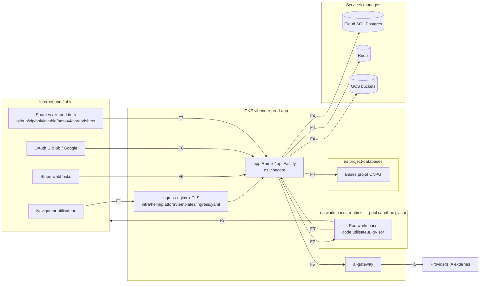

# THREAT_MODEL — E-Code (plateforme IDE cloud)

documentId: DOC-THREAT-MODEL
version: 1
parentContract: CTR-SECURITY-PRIVACY (SECURITY_PRIVACY_COMPLIANCE.md, contractVersion 3)
méthode: STRIDE par frontière de confiance
statut: livré pour revue (PENDING_REVIEW avec le contrat parent) — aucune menace auto-clôturée

Règle de rédaction : chaque menace pointe soit un contrôle EXISTANT dans le repo
(fichier:ligne, migration, workflow, PR), soit un **[GAP DÉCLARÉ]** avec gravité
et piste. Aucun contrôle cité sans vérification par grep dans l'arbre.

## 1. Périmètre

Dans le périmètre : l'app web (Remix) + l'API (Fastify/Prisma), les workspaces
utilisateur (pods gVisor sur GKE), les déploiements utilisateurs, les flux
Stripe/OAuth, l'AI gateway multi-provider, les imports/remix de contenu tiers,
les magasins de données (Cloud SQL Postgres, Redis, GCS, PVC).

Hors périmètre (traités par d'autres contrats) : DR/backup opérationnel
(`OPERATIONS_DR.md`), facturation/intégrité comptable
(`BILLING_LEDGER_CONTRACT.md`), IAM cloud (`IAM_POLICY_BASELINE.md`).

## 2. Diagramme de flux de données

## 3. Frontières de confiance (7)

| # | Frontière | Pourquoi c'est une frontière |
|---|---|---|
| F1 | Internet → ingress → app/api | tout entrant est non authentifié par défaut |
| F2 | api → pod workspace utilisateur | la plateforme (privilégiée) pilote du code non fiable |
| F3 | workspace → api / réseau | du code utilisateur arbitraire émet du trafic |
| F4 | api → Cloud SQL / Redis / GCS / CNPG | accès aux données de TOUS les tenants |
| F5 | api → providers IA | données tenant qui sortent vers des tiers |
| F6 | api ↔ Stripe / OAuth callbacks | entrants « machine » qui pilotent argent et identité |
| F7 | contenu tiers importé/remixé → plateforme | fichiers non fiables entrent dans des projets |

## 4. Menaces (STRIDE) par frontière

Statuts : **C** = couvert, contrôle ancré · **P** = partiel (contrôle réel + gap résiduel déclaré) · **G** = [GAP DÉCLARÉ].

### F1 — Internet → ingress → app/api

| ID | STRIDE | Scénario concret | Contrôle / gap | Statut |
|---|---|---|---|---|
| T-01 | S | Vol/forge d'un token de session pour agir comme la victime | Sessions opaques stockées hashées (`Session.tokenHash sha256` — `packages/database/prisma/schema.prisma:121`), `refreshHash`, `revokedAt`, `expiresAt` (schema:118-137) | C |
| T-02 | S | Un admin compromis exécute une mutation sensible sans challenge | Garde `requireAdminMfaForSensitiveAction` (`services/api/src/app.ts:4325`) + re-auth `lastReauthAt` (schema:125) | C |
| T-03 | R | Un opérateur nie une action d'admin (ex. impersonation) | `AuditLog` (schema:793) + `AdminAuditLog` (schema:830) ; impersonation tracée `Session.impersonatedBy` (schema:126-128) ; rédaction sans suppression de ligne (`store.redactAuditLogs`, app.ts:27582) | C |
| T-04 | I | Interception du trafic (MITM) | TLS terminé à l'ingress, cert-manager (`infra/helm/platform/templates/clusterissuer.yaml`, `ingress.yaml`) | C |
| T-05 | D | Flood L7 / DDoS sur le LB | [GAP DÉCLARÉ — gravité MOYENNE] DNS pointe directement sur le LB `34.1.6.93`, pas de CDN/WAF devant. Contrôle partiel : suivi d'abus applicatif (`AbuseEvent`, schema:1119). Piste : Cloud Armor ou CDN devant l'ingress. | G |
| T-06 | E | Un utilisateur standard atteint des routes admin | Modèle Role/Permission (schema:212-236) + gardes admin ci-dessus ; classes IDOR balayées par ~30 vagues d'audit multi-agents (docs/audits, référencées au contrat parent §Sécurité) | C |

### F2 — api → pod workspace utilisateur

| ID | STRIDE | Scénario concret | Contrôle / gap | Statut |
|---|---|---|---|---|
| T-07 | E | Le code utilisateur s'échappe du conteneur vers le nœud | gVisor imposé : Kyverno `require-gvisor-runtime` refuse tout pod workspace sans `runtimeClassName: gvisor` (`infra/admission/kyverno/workspace-security-policies.yaml:38-51`) ; pool dédié `sandbox-gvisor` (`infra/terraform/modules/gke-workspaces/main.tf:49,78-82`) ; défaut applicatif `WORKSPACE_RUNTIME_CLASS ?? 'gvisor'` (app.ts:4924) | C |
| T-08 | T | Un workspace lit/écrit les fichiers d'un autre tenant | PVC dédié par workspace, namespace runtime séparé (`workspaceRuntimeNamespace`), NetworkPolicy `allow-workspace-runtime-egress` scoping `app.kubernetes.io/name: vibecore-workspace` (`infra/helm/platform/templates/networkpolicy.yaml:99-151`) | C |
| T-09 | I | Secrets plateforme visibles depuis le pod utilisateur | Secrets plateforme dans `vibecore-platform-secrets` (K8s, ns vibecore) — jamais montés dans les pods workspace ; secrets projet chiffrés au repos (`ProjectSecret.valueEncrypted`, schema:473) et injectés en env uniquement | C |
| T-10 | D | Un workspace consomme CPU/RAM/disque au détriment des autres | `limitrange.yaml`, `resourcequota.yaml`, `pdb.yaml` (infra/helm/platform/templates/) + tailles machine facturées (RATE_CARD.json) | C |

### F3 — workspace (code utilisateur) → api / réseau

| ID | STRIDE | Scénario concret | Contrôle / gap | Statut |
|---|---|---|---|---|
| T-11 | S | Un pod workspace se fait passer pour un service plateforme | `deny-all-default` (networkpolicy.yaml:4) + allowlists explicites par policy ; canaux workspace authentifiés via `WorkspaceSession` (schema:644) | C |
| T-12 | I | SSRF depuis le workspace vers le réseau interne (métadonnées, DB, Redis) | Egress workspace confiné par `allow-workspace-runtime-egress` (networkpolicy.yaml:101) ; classes SSRF balayées (vagues d'audit, docs/audits). [Résiduel déclaré — gravité MOYENNE] : pas de preuve dans le repo d'un blocage explicite du metadata server GKE depuis le ns runtime ; piste : règle egress explicite 169.254.169.254 + test négatif. | P |
| T-13 | D | Un workspace martèle l'API (flood interne) | [GAP DÉCLARÉ — gravité BASSE] pas de rate-limit par workspace ancré dans le repo ; contrôle partiel : `AbuseEvent` (schema:1119) et quotas de facturation. Piste : rate-limit Fastify par identité workspace. | G |
| T-14 | S | Un déploiement utilisateur (`d-<id>.preview…`) sert du contenu qui usurpe la plateforme | Isolation de build : chaque build dans un répertoire jetable `.vibecore-deploy-<id>` (P0-1, commit `1c791405`) ; domaines de preview séparés du domaine app | C |

### F4 — api → Cloud SQL / Redis / GCS / CNPG

| ID | STRIDE | Scénario concret | Contrôle / gap | Statut |
|---|---|---|---|---|
| T-15 | T | Mutation/suppression d'écritures financières postées | Triggers Postgres append-only : `ledger_transaction_immutable`, `ledger_entry_immutable`, no-truncate (`packages/database/prisma/migrations/0078_double_entry_ledger/migration.sql:163-183`) — toute correction passe par transaction inverse | C |
| T-16 | I | Accès réseau direct à la DB/Redis depuis un pod non autorisé | `allow-database-redis-egress-managed` (networkpolicy.yaml:152-192) restreint l'egress DB/Redis aux pods plateforme ; IP privées (Cloud SQL 10.237.1.2, Redis 10.237.0.4) | C |
| T-17 | I | Lecture croisée d'objets GCS entre projets | Buckets par projet (contrat `APP_STORAGE_CONTRACT.md`, objets tracés `ProjectStorageObject`, schema:710) | C |
| T-18 | T | Bases projet CNPG accessibles depuis un autre tenant | ns dédié `project-databases`, egress plateforme explicitement listé (networkpolicy.yaml:45) | C |
| T-19 | D | Perte de données (suppression accidentelle/malveillante) | Drills DR joués : PITR 13m06s, disque 77s (`OPERATIONS_DR.md`, PR #36) | C |

### F5 — api → providers IA

| ID | STRIDE | Scénario concret | Contrôle / gap | Statut |
|---|---|---|---|---|
| T-20 | I | PII/code sensible d'un tenant envoyé aux providers sans politique | [GAP DÉCLARÉ — gravité MOYENNE] aucune politique DLP sortante formalisée ; contrôle partiel : configuration par provider/modèle (`ProviderConfig`/`ModelConfig`, schema:2007/2027) et traçabilité `AgentCallLog` (schema:2261). Piste : politique de minimisation + mention contractuelle par provider. | G |
| T-21 | S | Vol des clés provider de la plateforme | Secrets K8s dédiés (`infra/helm/platform/templates/ai-gateway-auth-secret.yaml`, `vibecore-platform-secrets`) ; repo public sans secret réel (gitleaks, cf. T-28) | C |
| T-22 | T | Injection de prompt : une réponse IA déclenche des actions outils non voulues | Contrat broker d'outils (`AGENT_TOOL_BROKER_CONTRACT.md`) + approbation de plan côté produit. [Résiduel déclaré — gravité MOYENNE] : pas de test négatif anti-injection ancré ; piste : suite de tests adversariaux sur le broker. | P |
| T-23 | D | Emballement de coûts IA (boucle agent, abus) | Réservation de crédits durable + hard limit `FOR UPDATE` (fix-forward PR #39 sur PR #27/#28), `LedgerReservation` (schema:2529), `UserSpendLimit` (schema:1991) | C |

### F6 — api ↔ Stripe / OAuth

| ID | STRIDE | Scénario concret | Contrôle / gap | Statut |
|---|---|---|---|---|
| T-24 | S | Webhook Stripe forgé crédite un wallet | Vérification de signature `stripe-signature` (app.ts:24678) ; test négatif signature invalide → rejet (`services/api/src/tests/api.spec.ts:2652`) | C |
| T-25 | T | Rejeu d'un webhook légitime (double crédit) | Journal `StripeEvent` (schema:973) + `StripeWebhookFailure` (schema:993) ; idempotence de l'octroi vérifiée dans `credit-packs-billing.spec.ts` | C |
| T-26 | S | CSRF/forge du state sur callback OAuth (login ou Git Connect) | State signé HMAC-SHA256 (app.ts:8752, vérif 8774) ; rejet 401 `OAUTH_STATE_INVALID` (app.ts:8913, 9026, 9091) | C |
| T-27 | I | Credentials OAuth des providers exposés | Stockés en DB via `LoginProviderConfig` (schema:920), édités uniquement via admin (mig 0052). [Résiduel déclaré — gravité BASSE] : chiffrement au repos de ces colonnes non prouvé dans le schéma ; piste : aligner sur `valueEncrypted`. | P |

### F7 — contenu tiers importé/remixé

| ID | STRIDE | Scénario concret | Contrôle / gap | Statut |
|---|---|---|---|---|
| T-28 | I | Un secret présent dans le repo public de la plateforme | gitleaks pre-commit (`.husky/pre-commit:30-40`) + job CI bloquant (`.github/workflows/security.yaml:129-130`), config `.gitleaks.toml` — I-SEC-3 | C |
| T-29 | I | Un secret contenu dans un import est propagé au projet | Scan read-only avant montage : `ImportJob.findings` « redacted, no value » (schema, modèle ImportJob), consentement par finding, machine à états avec `EXPIRED`/cleanup (`services/api/src/import-pipeline.ts:11,45,86`) ; `targetProjectId` null tant que non COMMITTED | C |
| T-30 | I | Un secret du projet source survit dans un remix | `CREDENTIALS_DETACHED` AVANT `CLONING` (`services/api/src/remix-pipeline.ts:6`) ; secret survivant → 409 quarantaine (I-SEC-1, prouvé) | C |
| T-31 | I | PII du propriétaire source exposée au remixeur | `SOURCE_SANITIZED` : masquage PII avant clone (`remix-pipeline.ts:250,314,322` — emails, cartes Luhn-valides ; jamais la valeur en log) — prouvé EN PROD (7bd91bcf, I-RMX-3) | C |
| T-32 | R/T | Contenu re-licencié silencieusement au remix | Licence fail-closed : défaut non-remixable, zéro re-licence MIT auto (#25, commit `7e001f3d` — I-SEC-2, prouvé) | C |
| T-33 | E | Code malveillant importé puis exécuté | Exécution uniquement dans le sandbox gVisor (renvoi T-07/T-08). [GAP DÉCLARÉ — gravité BASSE] : pas de scan antimalware du contenu importé ; piste : scan optionnel au staging d'import. | P |

## 5. Récapitulatif

| Mesure | Valeur |
|---|---|
| Frontières de confiance traitées | **7** |
| Menaces recensées | **33** |
| Couvertes avec contrôle ancré (C) | **26** |
| Partielles — contrôle réel + résiduel déclaré (P) | **4** (T-12, T-22, T-27, T-33) |
| Gaps déclarés purs (G) | **3** (T-05, T-13, T-20) |

26 + 4 + 3 = 33. Aucun statut « couvert » sans ancre fichier/migration/PR ; les 7 lignes de la vue §6 (3 gaps purs + 4 résiduels des menaces partielles) sont TOUTES à reporter dans les suivis.

## 6. Gaps déclarés — vue consolidée (à reporter dans les suivis)

| Gap | Gravité | Piste |
|---|---|---|
| T-05 : pas de CDN/WAF devant le LB | MOYENNE | Cloud Armor / CDN |
| T-12 : blocage metadata server GKE non prouvé depuis le ns runtime | MOYENNE | règle egress 169.254.169.254 + test négatif |
| T-13 : pas de rate-limit par workspace | BASSE | rate-limit Fastify par identité workspace |
| T-20 : pas de politique DLP sortante vers les providers IA | MOYENNE | politique de minimisation + engagement par provider |
| T-22 : pas de tests adversariaux anti-injection sur le broker d'outils | MOYENNE | suite de tests négatifs dédiée |
| T-27 : chiffrement au repos des credentials OAuth admin non prouvé | BASSE | aligner sur `valueEncrypted` |
| T-33 : pas de scan antimalware des imports | BASSE | scan au staging d'import |
